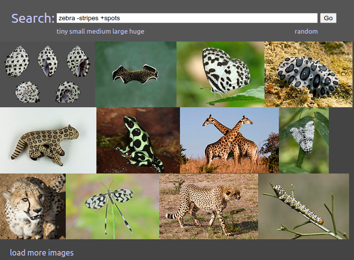

# Explore CLIP Embeddings in a rclip database

A simple FastAPI web service + Vue.js based UI over a [rclip](https://github.com/yurijmikhalevich/rclip)-style clip embedding database.

A [live demo of this software based on an index of wikimeda images can be seen here](http://image-search.0ape.com/).

It enables a search syntax like [zebra -stripes +spots](http://image-search.0ape.com/search?q=zebra%20-stripes%20%2Bspots) to do simple math on CLIP embeddings as shown in this screenshot.

Some other interesing searches:

* [zebra -stripes +spots](http://image-search.0ape.com/search?q=zebra%20-stripes%20%2Bspots) - Animals that look kinda like zebras but with spots instead of stripes.
* [zebra -mammal +fish](http://image-search.0ape.com/search?q=zebra%20-mammal%20%2Bfish) - Animals that are like zebras but fish instead of mammals.
* [zebra -animal +car](http://image-search.0ape.com/search?q=zebra%20-animal%20%2Bcar) - Animals that are like zebras but cars instead of animals.
* [zebra -"black and white"](http://image-search.0ape.com/search?q=zebra%20-%22black%20and%20white%22) - Baby zebras (brown & white) and a Greater Kudu (a brown & white striped 4-legged animal). Of course you could also find the same baby zebra searching for [zebra -big +small](http://image-search.0ape.com/search?q=zebra%20-big%20%2Bsmall) or even more simply, just [baby zebra](http://image-search.0ape.com/search?q=baby%20zebra).
* [furry black and white striped animal](http://image-search.0ape.com/search?q=furry%20black%20and%20white%20striped%20animal) - returns zebras and other furry black and white animals.
* [striped horse-like animal](http://image-search.0ape.com/search?q=striped%20horse-like%20animal) - more zebras (and horses with stripes)
* [zebra habitat -zebra](http://image-search.0ape.com/search?q=zebra%20habitat%20-zebra) - places that look like zebras might live there.

It can also do a search based on the difference between the CLIP embeddings of two images directly.  For example, CLIP considers difference between [this image of a spider on a purple flower](http://image-search.0ape.com/search?q=%7B%22image_id%22%3A28754%7D) minus [this image of the same kind of spider on a white flower](http://image-search.0ape.com/search?q=%7B%22image_id%22%3A174054%7D) to be [this set of pictures which is mostly purple flowers without the spider](http://image-search.0ape.com/search?q=%7B%22image_id%22%3A28754%7D%20-%7B%22image_id%22%3A174054%7D).

--

Thumbnail images in the screenshot are from Wikimedia Commons, and are released under various open source licenses. You can [perform the same search](http://image-search.0ape.com/search?q=zebra%20habitat%20-zebra) and click on an image to see the license for each respective image.
